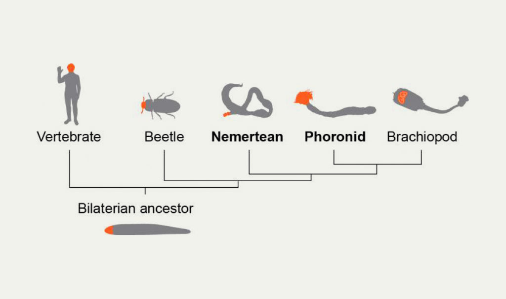
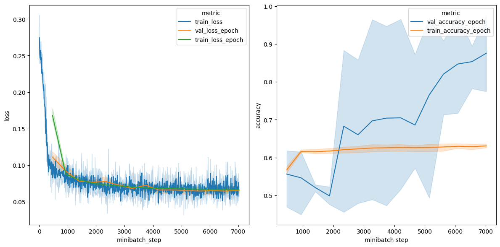
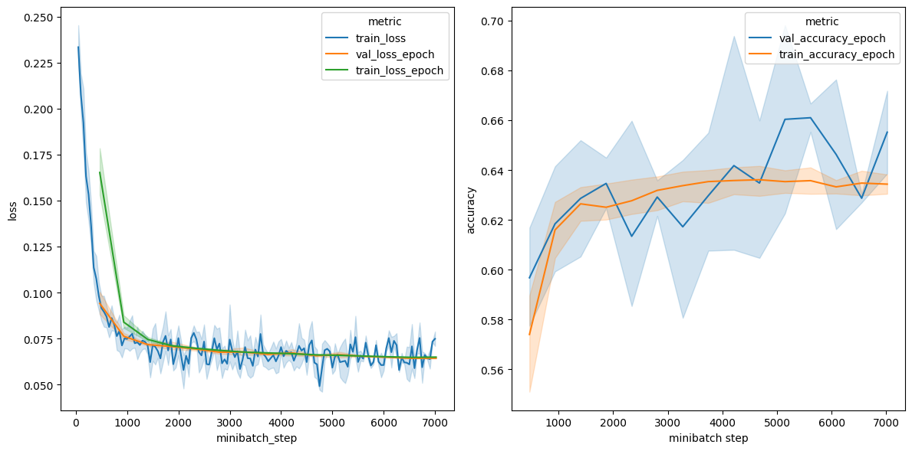
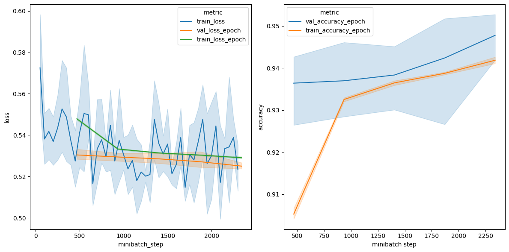
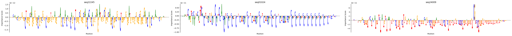
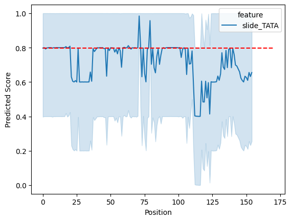

# Species-Specific DNA Classification Using Machine Learning

This project uses convolutional neural networks (CNNs) to classify DNA sequences as belonging to either humans or worms. By analyzing 200 bp-long sequences, the model identifies species-specific patterns and motifs, showcasing the power of deep learning in bioinformatics.

## Table of Contents
- [Background](#background)
- [Dataset](#dataset)
- [Model Architectures](#model-architectures)
  - [DeepBind CNN](#deepbind-cnn)
  - [SmallCNN](#smallcnn)
  - [IanCNN](#iancnn)
- [Model Performance](#model-performance)
- [Interpretability](#interpretability)
  - [Attribution Analysis](#attribution-analysis)
  - [Global Importance Analysis](#global-importance-analysis)
  - [Filter Interpretation](#filter-interpretation)
- [Concluding Thoughts](#concluding-thoughts)
---

## Background
Understanding species-specific DNA sequences has applications in:
- **Phylogenetics**: Exploring evolutionary histories and constructing phylogenetic trees.
- **Molecular Evolution**: Detecting conserved motifs under selective evolutionary pressure.
- **Forensics**: DNA-based species identification in complex scenarios.

There has been minimal work to classify DNA sequences from two different species, and no work with this specific dataset. 

This project aims to leverage machine learning to identify distinguishing DNA patterns and motifs.

---

## Dataset
The dataset contains:
- **Human DNA**: 3,250 sequences (200 bp each)
- **Worm DNA**: 3,250 sequences (200 bp each)

**Training/Validation Split**: 80% training, 20% validation  
**Target Variable**:  
- `1`: Human  
- `0`: Worm  

---

## Model Architectures

### DeepBind CNN
A simplified version of the DeepBind model was adapted for binary classification of 200 bp sequences. Features include:
- Single convolutional layer
- RELU activation
- Max pooling
- Fully connected layer
- Binary classifier

**Performance**:  
- Training Accuracy: 60%  
- Validation Accuracy: ~90% (overfitting suspected)

### SmallCNN
A smaller CNN with fewer layers was tested to address overfitting.  

    class SmallCNN(nn.Module):
      def __init__(self):  # define layers
          super(SmallCNN, self).__init__()
    
          # Set the attributes
          self.input_len = 200
          self.output_dim = 1
    
          # Create the blocks
          self.conv1 = nn.Conv1d(4, 30, 21)
          self.relu  = nn.ReLU()
    
          self.dense = nn.Linear(30, 1)
    
      def forward(self, x):  # define how inputs are propagated through those layers
          x = self.conv1(x)
          x = self.relu(x)
          x = F.max_pool1d(x, x.size()[-1]).flatten(1, -1)
          x = self.dense(x)
          return x

**Performance**:  

- Training Accuracy: 63%  
- Validation Accuracy: 65%  

### IanCNN
The final model introduced:
- Two convolutional blocks (128 filters each)
- Global average pooling
- Dropout layers to reduce overfitting
- Fully connected layers

      class IanCNN(nn.Module):
          def __init__(self):
              super().__init__()
      
              # Set the attributes
              self.input_len = 200  # Sequence length
              self.output_dim = 1  # Binary classification
      
              # Convolutional layers
              self.conv1 = nn.Conv1d(4, 128, kernel_size=13)
              self.bn1 = nn.BatchNorm1d(128)
      
              self.conv2 = nn.Conv1d(128, 128, kernel_size=13)
              self.bn2 = nn.BatchNorm1d(128)
      
              # Dropout layer (Drop 50% of neurons during training)
              self.dropout_conv = nn.Dropout(p=0.4)  # Dropout for convolutional layers
              self.dropout_fc = nn.Dropout(p=0.5)  # Dropout for fully connected layers
      
              # Max Pooling and Global Average Pooling
              self.pool = nn.MaxPool1d(kernel_size=2, stride=1)
              self.global_pool = nn.AdaptiveAvgPool1d(1)  # Global average pooling
      
              # Fully connected layers
              self.fc1 = nn.Linear(128, 128)  # First fully connected layer
              self.bn_fc1 = nn.BatchNorm1d(128)  # Batch normalization
              self.fc2 = nn.Linear(128, 128)  # Second fully connected layer
              self.bn_fc2 = nn.BatchNorm1d(128)  # Batch normalization
              self.fc3 = nn.Linear(128, self.output_dim)  # Final output layer
              self.sigmoid = nn.Sigmoid() # Add sigmoid activation
      
      
      
          def forward(self, x):
              # First convolutional layer
              x = self.pool(torch.relu(self.conv1(x)))
              x = self.bn1(x)  # Apply batch normalization
              x = self.dropout_conv(x)  # Apply dropout
      
      
              # Second convolutional layer
              x = self.pool(torch.relu(self.conv2(x)))
              x = self.bn2(x)  # Apply batch normalization
              x = self.dropout_conv(x)  # Apply dropout
      
              # Global average pooling to reduce the output size
              x = self.global_pool(x)  # Shape becomes (batch_size, 1024, 1)
      
              # Flatten the output for the fully connected layers
              x = x.view(x.size(0), -1)  # Flatten to (batch_size, 1024)
      
              # First fully connected layer
              x = torch.relu(self.fc1(x))
              x = self.bn_fc1(x)  # Apply batch normalization
              x = self.dropout_fc(x)  # Apply dropout
      
              # Second fully connected layer
              x = torch.relu(self.fc2(x))
              x = self.bn_fc2(x)  # Apply batch normalization
              x = self.dropout_fc(x)  # Apply dropout
      
      
              # Final output layer
              x = self.fc3(x)
              x = self.sigmoid(x) # Apply sigmoid activation
      
      
              return x

**Performance**:  
- Validation Accuracy: ~94%

---

## Model Performance
The IanCNN model achieved high validation accuracy, successfully identifying species-specific features in DNA sequences.

---

## Interpretability

### Attribution Analysis
Highlights the contribution of individual nucleotides to the model's predictions for specific sequences.

### Global Importance Analysis
Evaluates the model's response to inserting specific motifs (e.g., TATA box) at various positions in a sequence. Demonstrates the learned importance of motifs.

### Filter Interpretation
Analyzes positional nucleotide preferences captured by convolutional filters, uncovering potential motifs.

---

## Concluding Thoughts

Thanks for reading! This project was very exciting and any comments or feedback are welcome. 
